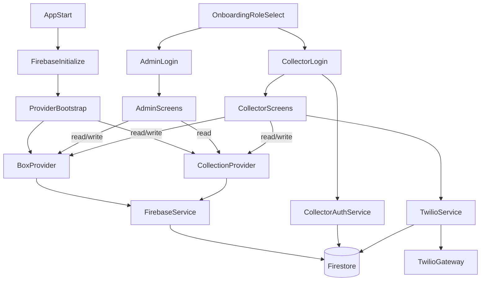

# Nagina Social Welfare UK - Architecture Memory Bank

This document captures the current implementation architecture of the Flutter app so future development and AI-assisted work can reason from a stable mental model.

## 1) System Context

- **App type:** Flutter client application targeting Android, iOS, web, and desktop shells.
- **Core backend dependency:** Firebase Firestore (primary data store) plus Firebase Auth usage for sign-out lifecycle.
- **Primary external gateway:** Twilio SMS through `twilio_flutter`, with credentials fetched from Firestore.
- **Main entrypoint:** `lib/main.dart`

Key references:
- `pubspec.yaml`
- `lib/main.dart`
- `lib/services/firebase_service.dart`
- `lib/services/twilio_service.dart`

## 2) Runtime and Composition Root

Startup sequence in `lib/main.dart`:
1. `WidgetsFlutterBinding.ensureInitialized()`
2. `Firebase.initializeApp()`
3. `runApp(MultiProvider(...))`
4. `MaterialApp(home: SplashScreen())`

`MultiProvider` currently registers:
- `BoxProvider`
- `CollectionProvider`

Note: `SessionProvider` exists at `lib/providers/session_provider.dart` but is not wired into `main.dart`.

## 3) Module Map

### `lib/models`
- `box_model.dart` - box entity, status enum, serialization, and `copyWith`.
- `collection_model.dart` - collection transaction entity and serialization.
- `collector_model.dart` - collector identity/profile record.

### `lib/providers`
- `box_provider.dart` - reactive box state, search/debounce logic, sequence allocation support via Firestore transaction, stream subscription.
- `collection_provider.dart` - reactive collection state and aggregate helpers (today/month totals, history).
- `session_provider.dart` - in-memory collector session (currently not integrated into app root).

### `lib/services`
- `firebase_service.dart` - CRUD + stream adapters for boxes/collections, admin info persistence, admin login, and batch reset operations.
- `collector_auth_service.dart` - collector username/password lookup against Firestore.
- `twilio_service.dart` - Twilio credentials fetch from Firestore and SMS dispatch.

### `lib/screens`
- `splash_screen.dart`, `onboarding_screen.dart` - startup and role selection.
- `screens/admin/*` - admin authentication, dashboard, box management, QR flow, summaries, collector management.
- `screens/collector/*` - collector authentication, dashboard, box selection/QR flow, collection entry, profile.

### `lib/widgets`
- shared UI components such as `app_drawer.dart` and `info_card.dart`.

## 4) Navigation Architecture

The app uses imperative navigation (`Navigator.push`, `pushReplacement`, `pushAndRemoveUntil`) with `MaterialPageRoute`. There is no named-route table or router package.

### Startup and Role Split

1. `SplashScreen` (`lib/screens/splash_screen.dart`) delays 3 seconds.
2. Push-replaces to `OnBoardingScreen` (`lib/screens/onboarding_screen.dart`).
3. Onboarding sends users to:
   - Admin path: `lib/screens/admin/login_screen.dart`
   - Collector path: `lib/screens/collector/collector_login_screen.dart`

### Admin Primary Flow

- `LoginScreen` authenticates via `FirebaseService.loginAdmin`.
- Success path goes to `DashboardScreen`.
- `DashboardScreen` routes to:
  - `AllBoxesScreen`
  - `MonthlySummaryScreen`
  - `QRScanScreen` -> `BoxDetailScreen` (after `getBoxByBoxId`)
  - `CollectorListScreen`
  - `AdminInformationScreen`
- Logout performs `FirebaseAuth.instance.signOut()` then returns to onboarding via `pushAndRemoveUntil`.

### Collector Primary Flow

- `CollectorLoginScreen` authenticates via `CollectorAuthService.login`.
- Success path builds `CollectorModel` then push-replaces to `CollectorDashboardScreen`.
- `CollectorDashboardScreen` routes to:
  - `SelectBoxScreen`
  - `QRScanScreen` (collector version) -> `BoxDetailForCollectorScreen`
  - `CollectorInformationScreen`
- Logout also signs out and resets to onboarding.

## 5) State Management and Data Lifecycle

## Provider Wiring

- `BoxProvider` and `CollectionProvider` are application-scoped through `MultiProvider`.
- Both providers subscribe to Firestore-backed streams at construction time.

## Box Lifecycle

`BoxProvider` responsibilities:
- Maintains `_boxes` and search state.
- Applies debounced filtering on `boxSequence` and `venueName`.
- Evaluates monthly rollover behavior (`evaluateBox`) and triggers status reset through service calls when conditions match.
- Delegates create/update operations to `FirebaseService`.

Write path (typical):
1. UI triggers provider/service method (e.g., add/update/reset/status change).
2. Service writes to Firestore.
3. Firestore stream emits latest snapshot.
4. Provider receives and updates local state.
5. UI updates via `context.watch`/`Consumer`.

## Collection Lifecycle

`CollectionProvider` responsibilities:
- Subscribes to `getCollections()` stream.
- Stores in-memory collection list.
- Provides derived aggregations:
  - `totalToday`
  - `totalThisMonth`
  - box-level totals/history
  - monthly grouped totals

## Screen-Level Stream Duplication Note

`CollectorDashboardScreen` also contains hidden `StreamBuilder` blocks that call `setBoxes` and `setCollections`, while providers already subscribe in constructors. This duplicates feed paths and may be redundant.

Reference: `lib/screens/collector/collector_dashboard_screen.dart`

## 6) Service Layer Contracts

### `FirebaseService` (`lib/services/firebase_service.dart`)

Main collection usage:
- `boxes`
  - add/update/delete
  - stream sorted by `createdAt desc`
  - lookup by `boxId`
  - status updates (`updateBoxStatus`, `completeBoxCycle`)
  - batch reset (`resetAllBoxesStatus`)
- `collections`
  - add with generated `id` field
  - stream all entries
- `admin/info`
  - read/write admin profile/config
  - credential validation in `loginAdmin`

### `CollectorAuthService` (`lib/services/collector_auth_service.dart`)

- Queries `collectors` collection by username and password.
- Returns first matching document merged with `id`, or `null`.

### `TwilioService` (`lib/services/twilio_service.dart`)

- Reads Twilio credential document in `twilio_credentials`.
- Constructs `TwilioFlutter` client and sends SMS.
- Throws when credentials are missing/incomplete.

## 7) Data Model Contracts

### `BoxModel` (`lib/models/box_model.dart`)

Core fields:
- Identity: `id`, `boxId`, `boxSequence`
- Assignment/context: `venueName`, optional `collectorName`
- Contact: `contactPersonName`, `contactPersonPhone`
- Collection metadata: `totalCollected`, `status`, optional `completedAt`
- Audit dates: `createdAt`, `updatedAt`

Status enum:
- `notCollected`
- `collected`
- `sentReceipt`

### `CollectionModel` (`lib/models/collection_model.dart`)

Core fields:
- `id`
- `boxId`
- `amount`
- `date`
- `receiptSent`
- `collectedBy`

### `CollectorModel` (`lib/models/collector_model.dart`)

Core fields:
- `id`
- `name`
- `username`
- `phone`
- `address`

## 8) End-to-End Architecture Flow

## 9) Known Gaps and Risks

- `SessionProvider` is present but not integrated into app composition root.
- Collector dashboard has additional stream listeners that duplicate provider subscriptions.
- Authentication checks are Firestore-document based (`admin/info`, `collectors`) and appear to store credential values directly; evaluate security posture separately.
- `auth_gate.dart` exists but is not the active startup home in `main.dart`.

## 10) Change Impact Guidance

When modifying architecture, update this file if you change:
- App startup entry or route strategy.
- Provider registration or subscription behavior.
- Firestore collection schema or service contracts.
- Authentication flow or credential storage strategy.
- External integrations (Twilio, QR, export/printing).

Recommended update order for future changes:
1. `main.dart` and navigation docs
2. provider/service contract sections
3. model field contract sections
4. known gaps/risks and diagram

## 11) Cash Receipt Subsystem

- Admin-only receipt flow is implemented from `DashboardScreen`.
- Data is stored in Firestore collection `cash_receipts`.
- New model: `lib/models/cash_receipt_model.dart`.
- New provider: `lib/providers/cash_receipt_provider.dart`.
- New screens:
  - `lib/screens/admin/generate_cash_receipt_screen.dart`
  - `lib/screens/admin/receipt_log_screen.dart`
- New service utility:
  - `lib/services/receipt_pdf_service.dart` for generating and sharing PDF receipts.
- Dashboard now includes:
  - action to generate cash receipt
  - action to view receipt log
  - monthly cash total stat card sourced from `CashReceiptProvider.monthlyTotal()`.
